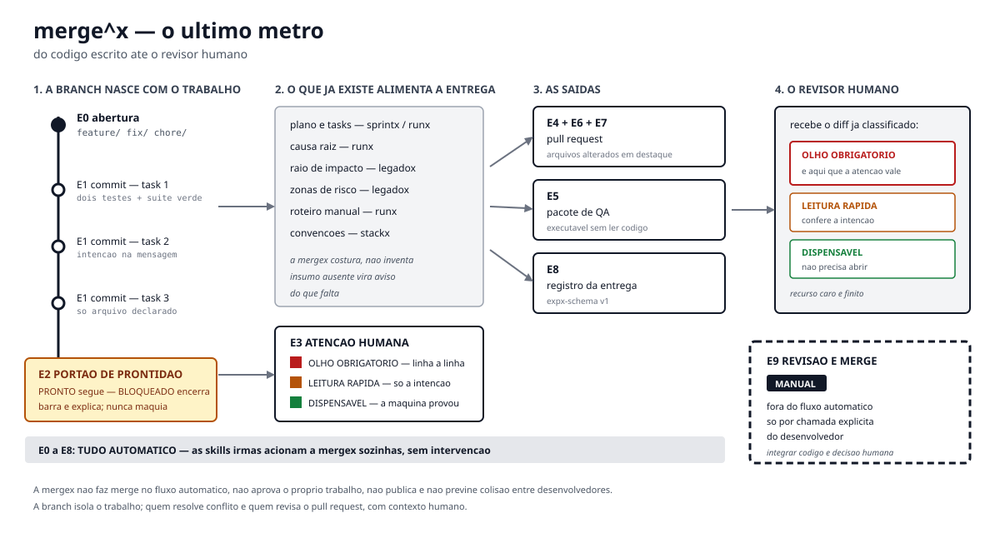

<div align="center">

<picture>
  <source media="(prefers-color-scheme: dark)" srcset="https://raw.githubusercontent.com/bittencourtthulio/mergex/main/.github/assets/banner-dark.svg">
  <source media="(prefers-color-scheme: light)" srcset="https://raw.githubusercontent.com/bittencourtthulio/mergex/main/.github/assets/banner-light.svg">
  
</picture>

<p>
  
  
  
  
  
  
  
</p>

<strong>A camada de entrega do método Expx</strong> — leva o trabalho feito até o repositório<br>
e até o revisor humano, para <a href="https://claude.com/claude-code">Claude Code</a> e <a href="https://opencode.ai">OpenCode</a>.

</div>

`mergex` cria a branch quando o trabalho começa, commita cada task concluída, barra o que não está pronto, classifica o diff por onde a atenção humana vale a pena, monta a descrição do pull request, gera o pacote de QA e abre o PR.

> **Ela não gera conteúdo novo sobre a mudança.**
> Tudo que escreve vem de arquivo existente: plano, causa raiz, raio de impacto, roteiro manual, convenções do repositório. Insumo ausente vira aviso do que falta, nunca invenção.

---

## O ecossistema Expx

O método Expx é um conjunto de skills que se compõem, instaladas e mantidas pelo CLI [`expxdev`](https://github.com/bittencourtthulio/expxdev).

| Peça | Papel | Relação com a `mergex` |
|---|---|---|
| **[expxdev](https://github.com/bittencourtthulio/expxdev)** | o CLI: instala, atualiza e diagnostica o ecossistema, e sobe o painel de operação | é quem instala esta skill (`npx expxdev init`) |
| **[sprintx](https://github.com/bittencourtthulio/sprintx)** | **Build** — feature nova, F1…F6 | E0 no início da F6, E1 a cada task, E2–E8 ao fim |
| **[runx](https://github.com/bittencourtthulio/runx)** | **Run** — ocorrência em produção, E1…E5 | E0 no início do fix, E1 a cada task, E2–E8 entre o QA e o relatório |
| **[legadox](https://github.com/bittencourtthulio/legadox)** | **camada** de segurança para código legado | raio, caracterização, reversão e dívida alimentam o portão, a classificação e o PR |
| **[stackx](https://github.com/bittencourtthulio/stackx)** | **camada** de convenções do repositório | convenções de branch, commit e teste vêm do `CONVENCOES.md` |
| **mergex** *(este repositório)* | entrega: o último metro, E0…E9 | — |

A `mergex` é a **última peça do fluxo**: as irmãs produzem os artefatos, ela os costura na entrega. **A ausência da `mergex` nunca quebra o fluxo das outras skills**, e a ausência de qualquer irmã nunca quebra o fluxo da `mergex`.

Detalhes do ecossistema inteiro no [README do expxdev](https://github.com/bittencourtthulio/expxdev).

---

## O problema: o último metro

Um plano impecável termina com código escrito. E aí ele para.

O pull request chega ao revisor com 600 linhas, título de uma frase e nenhum contexto. O revisor não participou do planejamento, não leu a causa raiz, não sabe o raio de impacto e não faz ideia de qual daqueles 40 arquivos é o que pode derrubar a folha de pagamento. Então ele faz a única coisa possível: lê tudo por igual — e, lendo tudo por igual, a mudança de uma linha na regra fiscal passa com a mesma atenção que o arquivo de teste de 300 linhas. Todo o rigor do método se perde no último metro, exatamente onde ele deveria ser convertido em confiança.

Numa software house com QA e suporte separados do desenvolvimento, essa fronteira é o ponto mais caro do fluxo. O QA recebe "testa aí" e abre o código para descobrir o que mudou. O suporte espera alguém traduzir a entrega para o cliente.

E há o problema de vários desenvolvedores no mesmo projeto: sem branch nascendo junto com o trabalho, tudo acontece na branch em que o dev estava — normalmente a principal.

---

## Compatibilidade

`mergex` funciona em **Claude Code** e em **OpenCode**, a partir da mesma fonte. As skills ficam **apenas** em `.claude/skills/` nos dois harnesses — o OpenCode lê `.claude/skills/*/SKILL.md` nativamente, e duplicar a árvore causaria colisão de nome. Só os comandos existem nas duas pastas, porque cada harness lê a sua:

| | Claude Code | OpenCode |
|---|---|---|
| Skill (projeto) | `.claude/skills/mergex/` | a mesma pasta, lida nativamente |
| Comandos (projeto) | `.claude/commands/` | `.opencode/commands/` |
| Skill (global) | `~/.claude/skills/mergex/` | a mesma pasta |
| Comandos (global) | `~/.claude/commands/` | `~/.config/opencode/command/` |

O `AGENTS.md` na raiz instrui o agente a acionar a skill nos pontos certos, em qualquer harness.

---

## Instalação

### Pelo CLI do método (recomendado)

```bash
npx expxdev init
```

O `init` busca a `mergex` na versão publicada, empacota como plugin local e configura o harness. Os comandos ficam com namespace no Claude Code (`/expx:mergex-check`) e sem namespace no OpenCode (`/mergex-check`).

### Claude Code

```bash
git clone https://github.com/bittencourtthulio/mergex.git /tmp/mergex
mkdir -p .claude/skills .claude/commands .claude/hooks .claude/agents .expx
cp -r /tmp/mergex/.claude/skills/mergex .claude/skills/
cp /tmp/mergex/.claude/commands/mergex*.md .claude/commands/
cp -r /tmp/mergex/.claude/hooks/. .claude/hooks/
cp /tmp/mergex/.claude/agents/*.md .claude/agents/
cp /tmp/mergex/.expx/hooks.json .expx/
cp /tmp/mergex/AGENTS.md .
```

Os hooks precisam do registro em `.claude/settings.json`. Se o arquivo ainda
não existe, copie o do repositório; se já existe, **junte** o bloco `hooks` ao
seu — não sobrescreva, porque ele pode ter configuração sua:

```bash
cp /tmp/mergex/.claude/settings.json .claude/settings.json   # só se não existir
```

Para usar em todos os projetos, troque `.claude/` por `~/.claude/`.

### OpenCode

A skill vai no mesmo lugar; muda só a pasta dos comandos:

```bash
git clone https://github.com/bittencourtthulio/mergex.git /tmp/mergex
mkdir -p .claude/skills .claude/hooks .opencode/commands .opencode/plugin .opencode/agent .expx
cp -r /tmp/mergex/.claude/skills/mergex .claude/skills/
cp /tmp/mergex/.opencode/commands/mergex*.md .opencode/commands/
cp -r /tmp/mergex/.claude/hooks/. .claude/hooks/
cp /tmp/mergex/.opencode/plugin/mergex.ts .opencode/plugin/
cp /tmp/mergex/.opencode/agent/*.md .opencode/agent/
cp /tmp/mergex/.expx/hooks.json .expx/
cp /tmp/mergex/AGENTS.md .
```

Os scripts dos hooks ficam em `.claude/hooks/` mesmo no OpenCode: o plugin em
`.opencode/plugin/mergex.ts` invoca os mesmos arquivos. A lógica não é
duplicada — só o registro difere.

### Verificação

```bash
ls .claude/skills/mergex/SKILL.md
ls .claude/commands/mergex*.md    # ou .opencode/commands/
./.claude/hooks/teste.sh          # a suíte dos hooks: 48 casos
```

A suíte precisa de `bash`, `jq` e `git`. Se ela passar, os hooks estão no
lugar e funcionando.

---

## Uso

### O jeito mais simples

Não é preciso chamar a skill pelo nome. Ao iniciar a implementação de uma feature (`sprintx`) ou de uma ocorrência (`runx`), a `mergex` abre a branch sozinha; a cada task que fecha com a suíte verde, ela commita.

1. **Comece um trabalho.** Para chamá-la à mão: `/mergex-abrir`.
2. **Implemente.** Cada task que fecha vira um commit.
3. **Confira antes de entregar:** `/mergex-check` roda o portão e diz o que falta.
4. **Entregue:** `/mergex` roda o fluxo completo — classificação, descrição, pacote de QA, push e PR.
5. **Quando você quiser revisar:** `/mergex-revisar`. Só quando você quiser.

### Comandos

| Comando | O que faz |
|---|---|
| `/mergex` | fluxo automático completo a partir do estado atual |
| `/mergex-abrir` | **E0** — abre a branch do trabalho |
| `/mergex-check` | **E2** — portão de prontidão |
| `/mergex-atencao` | **E3** — classifica o diff nas três faixas |
| `/mergex-pr` | **E4, E6, E7** — descrição, push e abertura do PR |
| `/mergex-qa` | **E5** — pacote para o QA |
| `/mergex-revisar` | **E9** — revisão e merge; manual, só por chamada explícita |

---

## As dez etapas

```
E0 BRANCH → E1 COMMIT → E2 PORTÃO → E3 ATENÇÃO → E4 PR → E5 QA → E6 PUSH → E7 ABERTURA → E8 REGISTRO   ·   E9 REVISÃO (manual)
```

As nove primeiras são automáticas; a décima só roda quando você a chama.

<picture>
  <source media="(prefers-color-scheme: dark)" srcset="assets/mergex-fluxo-dark.svg">
  
</picture>

| Etapa | Quando | O que faz |
|---|---|---|
| **E0** Abertura | No início do trabalho | Cria a branch antes da primeira linha de código. Árvore suja: para e avisa. Branch que já existe: retoma nela |
| **E1** Commit por task | A cada task que fecha | Um commit por task, com a intenção na mensagem. Varredura de segredo antes de cada um |
| **E2** Portão de prontidão | Ao fim da execução | Dez verificações. `PRONTO` ou `BLOQUEADO` com o que falta. Nunca maquia |
| **E3** Atenção humana | Depois do portão | Classifica o diff nas três faixas, arquivo por arquivo, com a evidência de cada um |
| **E4** Descrição do PR | Depois da classificação | Monta a descrição a partir dos artefatos. Cabe em uma tela |
| **E5** Pacote de QA | Antes do push | Documento executável por quem não programa |
| **E6** Push | Depois do portão e do pacote | Sobe a branch. Nunca forçado, nunca na principal |
| **E7** Abertura do PR | Depois do push | Abre o PR pela ferramenta do serviço. Ausente, grava em arquivo e informa |
| **E8** Registro | Ao fim | Grava o registro da entrega, com frontmatter, para o painel de operação |
| **E9** Revisão e merge | **Só quando você chama** | Lista os PRs abertos, ordena por impacto e conduz um merge por vez |

---

## As três faixas de atenção humana

O revisor humano é recurso caro e finito. O trabalho da `mergex` é gastar esse recurso onde ele muda o resultado, e não gastá-lo onde a máquina já provou.

| Faixa | O que o revisor faz | Quando um arquivo cai aqui |
|---|---|---|
| **OLHO OBRIGATÓRIO** | Lê linha a linha | Zona de risco declarada; regra de negócio ou cálculo; migração de banco, qualquer uma; autenticação, autorização, dado pessoal; contrato público (rota, payload, evento, retorno); código sem cobertura antes e depois; efeito irreversível; raio ALTO |
| **LEITURA RÁPIDA** | Confere a intenção, não a implementação | Coberto por caracterização que continua passando; camada isolada com cobertura existente; código novo em arquivo novo com os dois testes verdes |
| **DISPENSÁVEL** | Não abre — a máquina já provou | Teste que só acrescenta caso; alteração mecânica coberta por regressão verde; arquivo gerado automaticamente, quando declarado como tal |

A classificação é **derivada de evidência registrada** — zonas de risco, raio, cobertura, tipo de mudança. Nunca de sensação. Na dúvida entre duas faixas, sobe para a mais rigorosa e diz por quê.

**Tamanho de diff não é critério.** Um arquivo de uma linha em zona de risco fiscal é OLHO OBRIGATÓRIO; um lockfile de 4.000 linhas é DISPENSÁVEL. É exatamente essa inversão que a leitura por diff não consegue fazer.

---

## O comando de revisão: por que ele é o único manual

Todo o resto do fluxo é automático — as skills irmãs acionam a `mergex` sozinhas e ela entrega sem intervenção. `/mergex-revisar` é a única exceção do ecossistema.

Ele não é encadeado por nenhum fluxo, não é sugerido ao fim de um trabalho, não aparece como próximo passo em relatório nenhum, e só roda quando você o chama pelo nome. **Integrar código é decisão humana.**

Quando você chama, ele:

- lista os PRs abertos e reúne o estado de cada um: raio, faixas de atenção, integração contínua, conflito;
- destaca no topo os PRs que tocam o mesmo arquivo;
- ordena **do menor para o maior impacto** — cada merge fácil que entra reduz a superfície do próximo, e adiar o difícil não o piora, enquanto adiar o fácil sim;
- conduz um PR por vez, com confirmação explícita de cada um.

Ele **nunca resolve conflito**. Relata onde está, quais arquivos e trechos, e o que cada lado pretendia segundo a mensagem de commit e o plano de cada trabalho — essa análise é o que ele tem de mais útil. A resolução é humana. E nunca faz merge com integração vermelha, de PR em rascunho, em lote, ou de PR com arquivos em olho obrigatório sem que você confirme que os revisou.

---

## O pacote de QA: por que existe numa casa com QA separado

Quando o QA não é quem escreveu o código, "testa aí" custa uma tarde: ele abre o diff, tenta inferir o que mudou, e testa o que conseguiu adivinhar.

O `QA-PACOTE.md` tem um critério de qualidade só, e é duro: **o QA não deve precisar ler código para trabalhar.** Ele traz o que mudou em linguagem de produto, o roteiro completo dentro do próprio arquivo, o que observar de colateral nas telas vizinhas, dado de teste fictício, o ambiente e como chegar ao estado inicial, e um critério de aprovação binário.

Em trabalho vindo da `runx`, ele aponta ainda o relatório de uso: o texto que o suporte devolve ao cliente depois da aprovação.

---

## O que a mergex NÃO faz

- **Não aprova o próprio trabalho.** Prepara a revisão; não a dispensa nem a substitui.
- **Não faz merge no fluxo automático.** A integração é sempre decisão humana.
- **Não cria release, não publica, não faz deploy.**
- **Não altera código para caber na entrega.** Trabalho incompleto é barrado, nunca maquiado.
- **Não fecha a ocorrência.** A `mergex` entrega; quem fecha é a `runx`.

> ### Não previne colisão entre desenvolvedores
>
> A `mergex` não avisa que outro trabalho planeja tocar o mesmo arquivo, não reserva arquivo e não resolve conflito. **A branch isola o trabalho; ela não impede que duas pessoas alterem o mesmo código.** Quem resolve conflito é quem revisa o pull request, com contexto humano.
>
> É por isso que duas coisas são tratadas como prioritárias na skill: a **mensagem de commit por task**, que é o que permite entender a intenção de cada mudança durante um merge difícil, e a **lista de arquivos alterados em destaque no PR**, que é o que permite ao revisor perceber sobreposição com outro PR aberto sem ferramenta nenhuma.

---

## Hooks e agentes: as regras viram mecânica

Toda regra inviolável da skill era, até aqui, uma instrução que o modelo podia esquecer numa execução longa. Os **hooks** mudam isso: quem os executa é o harness, não o modelo, e eles rodam sempre.

| Hook | Modo | O que garante |
|---|---|---|
| `sem-segredo` | **bloqueio** | Varredura a cada commit e a cada escrita, não só no portão |
| `git-perigoso` | **bloqueio** | Nunca forçado, nunca na principal, nunca reescrever o já enviado, nunca descartar alteração local |
| `branch-limpa` | **bloqueio** | Nunca criar ou trocar branch com alteração pendente |
| `commit-por-task` | aviso | Um commit por task, concluída e com suíte verde |
| `arquivo-fora-do-plano` | aviso | Nada commitado fora da lista declarada na task |
| `pr-so-com-portao` | aviso | Sem `PRONTO` no portão, não sobe e não abre PR |

Os de segurança nascem em **bloqueio**: segredo commitado não tem volta. Os de método nascem em **aviso** e só sobem depois de rodarem sem falso positivo — porque **hook que atrapalha é desinstalado, e junto com ele vão os que funcionavam.** O modo de cada um vive em `.expx/hooks.json`.

Dois agentes rodam em contexto próprio, somente leitura: **`revisor-diff`** classifica o diff nas três faixas sem ter visto a implementação sendo escrita, e **`analista-de-conflito`** explica o que cada lado de um conflito pretendia. Este último **não tem ferramenta de escrita nem de execução de comando** — é impossibilidade técnica, não disciplina, que o impede de resolver o conflito.

**Nos dois harnesses, a lógica é a mesma.** O plugin do OpenCode invoca os mesmos scripts de `.claude/hooks/`; só o registro difere. Detalhe, os três cuidados de desenho e a suíte: [`.claude/hooks/README.md`](.claude/hooks/README.md).

---

## Integração com as skills irmãs

| Skill | Como se integra |
|---|---|
| [`sprintx`](https://github.com/bittencourtthulio/sprintx) | E0 no início da F6, E1 a cada task, E2–E8 ao fim — [patch](docs/integracao/patch-sprintx.md) |
| [`runx`](https://github.com/bittencourtthulio/runx) | E0 no início do fix, E1 a cada task, E2–E8 entre o QA e o relatório — [patch](docs/integracao/patch-runx.md) |
| [`legadox`](https://github.com/bittencourtthulio/legadox) | Sem acionamento próprio: raio, caracterização, reversão e dívida alimentam o portão, a classificação e o PR — [patch](docs/integracao/patch-legadox.md) |
| [`stackx`](https://github.com/bittencourtthulio/stackx) | Convenções de branch, commit e teste vêm do `CONVENCOES.md` — [patch](docs/integracao/patch-stackx.md) |

Os patches em [`docs/integracao/`](docs/integracao/) são prompts prontos para colar no repositório de cada skill irmã. Nenhum deles altera comportamento quando a `mergex` não está instalada.

---

## Estrutura em disco

Tudo que a `mergex` produz por trabalho:

```
docs/entrega/<trabalho_id>/
  ATENCAO.md          E3 — o diff classificado nas três faixas, com evidência
  PR.md               E4 — a descrição do pull request
  QA-PACOTE.md        E5 — o roteiro executável por quem não programa
  ENTREGA.md          E8 — o registro da entrega, com frontmatter para o painel
```

`<trabalho_id>` é o mesmo identificador do trabalho na skill irmã: o `<slug-da-feature>` da `sprintx` ou o `<OC-ID>-<slug>` da `runx`. Um trabalho, uma entrega, um nome.

---

## Estrutura do repositório

```
.claude/
  skills/mergex/
    SKILL.md                    identidade, etapas, faixas, regras invioláveis
    references/                 roteiro operacional detalhado de cada etapa
    assets/
      TEMPLATE-*.md             templates preenchíveis
  commands/mergex*.md           os comandos do Claude Code
  hooks/                        os seis hooks e a suíte de testes
  agents/                       revisor-diff e analista-de-conflito
  settings.json                 registro dos hooks no Claude Code
.opencode/
  commands/mergex*.md           os mesmos comandos, no formato do OpenCode
  plugin/mergex.ts              a ponte que roda os mesmos hooks no OpenCode
  agent/                        os mesmos agentes, no formato do OpenCode
.expx/hooks.json                o modo de cada hook (aviso ou bloqueio)
docs/integracao/                os patches para colar em cada skill irmã
exemplos/                       artefatos preenchidos de um caso real
assets/                         diagrama de fluxo do README
.github/assets/                 banner e badges do README
AGENTS.md                       instruções de acionamento para o agente
```

O `SKILL.md` é a porta de entrada e fica enxuto. O detalhe operacional de cada etapa mora no `reference` correspondente, lido **só quando a etapa chega** — mantendo o contexto pequeno.

Exemplos de saída real em [`exemplos/`](exemplos/): uma correção de regra de cálculo fiscal vinda da `runx`, em projeto sob modo legado com raio ALTO.

---

## Licença

MIT. Veja [LICENSE](LICENSE).

---

## Como contribuir

Abra uma issue descrevendo o caso concreto — o repositório, a etapa e o que aconteceu — antes de abrir um PR grande.

Contribuições que preservam as regras invioláveis da skill são bem-vindas. As que as flexibilizam precisam do caso de uso que as justifica: elas existem porque cada uma resolve um jeito específico de o último metro dar errado. Em particular, `/mergex-revisar` não vira automático.

---

<div align="center">
<sub>Parte do método <strong>Expx</strong> ·
<a href="https://github.com/bittencourtthulio/expxdev">expxdev</a> ·
<a href="https://github.com/bittencourtthulio/sprintx">sprintx</a> ·
<a href="https://github.com/bittencourtthulio/runx">runx</a> ·
<a href="https://github.com/bittencourtthulio/legadox">legadox</a> ·
<a href="https://github.com/bittencourtthulio/stackx">stackx</a> ·
mergex</sub>
</div>
